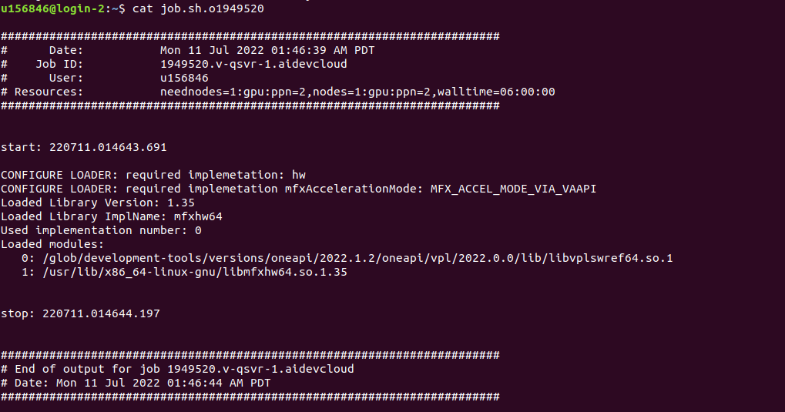

上图为跑av1的本地software实现

上图为跑av1的hardware实现 sample_decode

上图为跑av1的hardware实现 sample_decode

上图为跑hevc的software实现（两分钟+) hello-decode（hello-decode没有实现gpu实现）

cpu实现的testav1大小

尝试解码100m的av1视频，并且以yuv格式存储，太大了放不下

resolution：1920*1080 

frame rate：30

解码2m的av1视频，并且以yuv格式存储

